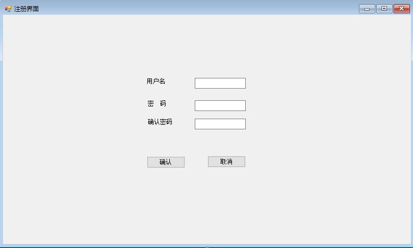

# WinForm-application （窗体应用程序开发）

首先介绍一下，工程项目是Company System文件夹，Knowledge point是项目用到的一些知识点的总结

根据[教程](http://c.biancheng.net/csharp/10/)一步一步来把C#学精，学透，并且把相应的成品放在上面。

注册功能界面

# 用到的窗体控件

Windows窗体应用程序就是利用一系列的窗体控件来实现的

